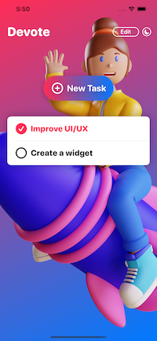
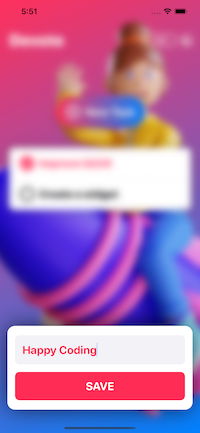
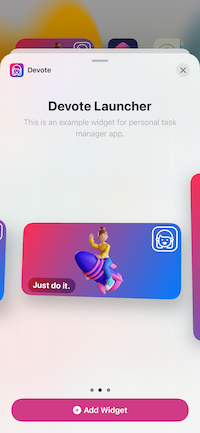
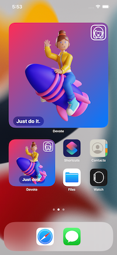

# Devote
Personal task manager app (Sample SwiftUI App)
- Integrate Core Data with SwiftUI
- Create, Read, Update and Delete database items
- Toggle Light and Dark mode appearances
- Store the app's appearance using the App Storage
- Custom Toggle style and make a checkbox
- Create Visual effects with SwiftUI’s blur and color overlay mode
- Basic Widgets
- Different Widget sizes

  

 
